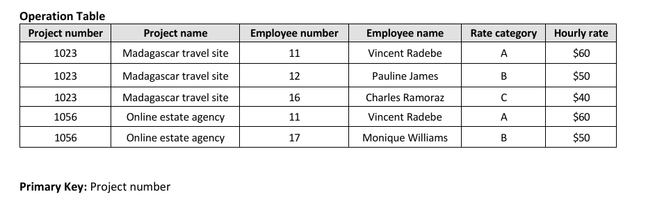
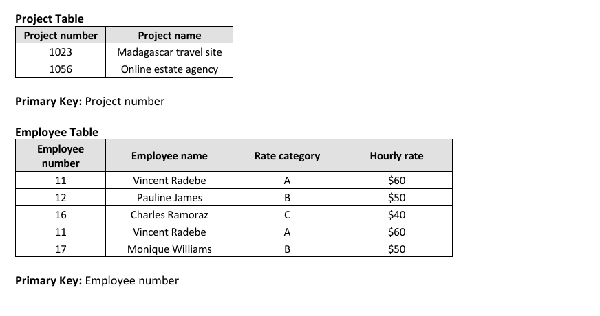
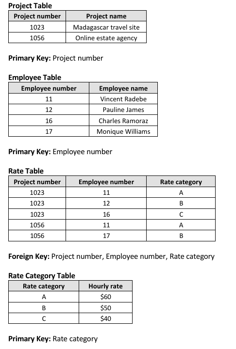

# Assignment 2: Advanced Relational Data Normalization Process 

## 1. Assignment Summary
This assignment investigated the mathematical and structural principles of data optimization, specifically focusing on the relational normalization process. Working with multi-attribute, non-normalized datasets (including college traffic offence registries and corporate project rate sheets), the goal was to eliminate data redundancy and prevent data modification anomalies. I systematically dissected raw unnormalized data blocks and advanced them step-by-step through **First Normal Form (1NF)**, **Second Normal Form (2NF)**, and **Third Normal Form (3NF)** to establish highly optimized, clean database relations.

---

## 2. Evidence and Explanation

*Figure 1: First Normalization Table*

*Figure 2: Second Normalization Table*

*Figure 3: Third Normalization Table*

* **Anomaly and Redundancy Assessment:** Evaluated unnormalized student fine logs to identify data anomalies (insertion, deletion, and update issues) caused by repeating data cells and embedded multi-valued string lists.
* **First Normal Form (1NF) Flat Conversion:** Re-engineered composite records into structural rows and columns, creating a flat atomic grid where every intersecting cell holds only a single indivisible data element.
* **Second Normal Form (2NF) Dependency Resolution:** Identified composite primary keys within flat relations and mapped out partial functional dependencies. Resolved these partial dependencies by splitting them into distinct parent tables to ensure every non-key value depends completely on the primary identifier.
* **Third Normal Form (3NF) Transitive Cleanup:** Cleaned up hidden multi-stage dependencies by removing transitive functional attributes (where a non-key column references another non-key column, such as employee rate categories mapping directly to hourly costs). Moved these components into separate lookup tables to achieve full 3NF compliance.

---

## 3. Reflection

### What I Learned
* Working through the normalization process step-by-step changed how I view data storage. Moving a chaotic dataset up to 3NF showed me exactly how to prevent data corruption and ensure long-term database stability.
* Separating partial and transitive dependencies taught me to see hidden relationships between data fields. Learning to isolate non-key attributes into dedicated tables ensures that updates happen cleanly without breaking surrounding records.
* Dissecting the core causes of data anomalies made me realize how easily poor designs can lead to data loss. I now appreciate why structured optimization steps are essential for building high-fidelity database systems.

### Areas for Improvement
* Deconstructing complex datasets into highly normalized multi-table schemas can increase the number of relational joins needed during retrieval. I need to practice balancing structural normalization against query performance parameters.
* While 3NF provides excellent coverage for most corporate setups, I want to explore edge-case normalization techniques, such as Boyce-Codd Normal Form (BCNF), to handle specialized tables with overlapping candidate keys.
