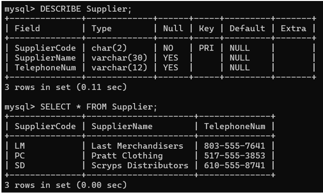

# Lab Activity 1: Physical Schema Implementation and Desktop Relational Storage 

## 1. Lab Summary
This practical lab focused on building a desktop relational database using the Microsoft Access environment. Acting as a database developer for *Tennis Logos (TL)*, a customized sports apparel firm, the objective was to move business data from flat, disconnected Excel data sheets into an integrated relational system. I constructed physical table schemas, applied structured alphanumeric field properties, and configured primary-to-foreign key mappings. This process eliminated lookup redundancies while enforcing referential consistency between corporate vendor lists and inventory item descriptions.

---

## 2. Evidence and Explanation

*Figure 1: Supplier Table printed using DESCRIBE and SELECT* *

* **Relational Space Initialization:** Provisioned the unified relational storage shell container under the deployment name `TL_Sport Database` using blank desktop initialization configurations.
* **Supplier Constraints Mapping:** Engineered the structural blueprint for the `Supplier` table. Applied strict custom field metrics—defining the `Supplier Code` primary key space with a precise 2-character limit and mapping standard text fields for corporate naming metadata.
* **Inventory Dependency Modeling:** Constructed the dependent `Item` inventory table. Linked individual item number elements back to parent suppliers by implementing a relational foreign key attribute using matching text constraints (`Supplier Code`).
* **Foreign Key Referential Alignment:** Populated tables with live catalog sets, including wholesale costs, baseline item costs, and stock quantities. This validated that the foreign key linkages successfully mapped items onto correct supplier parent rows.

---

## 3. Reflection

### What I Learned
* Setting up physical tables inside a database manager taught me that a solid design depends on exact column rules. Learning to limit field sizes and enforce strict text patterns showed me how to keep input clean right from the start.
* Connecting the item inventory back to the supplier table using matching code categories made relational mechanics crystal clear. I learned how referencing explicit primary keys keeps tables aligned and stops duplicate vendor data from cluttering the system.
* Transferring unstructured spreadsheet grids into organized rows and columns proved how valuable desktop database engines are. It highlighted how switching to structured lookups prevents data mismatch issues across catalog layers.

### Areas for Improvement
* Manually typing large sets of inventory records can open the door to typing errors. I want to practice setting up automated bulk validation checks or importing data through structured staging tables to handle data securely.
* While simple field limits prevent basic input errors, I want to explore advanced custom rules within table settings. Adding pattern filters would block formatting mistakes before records ever hit the table storage.
